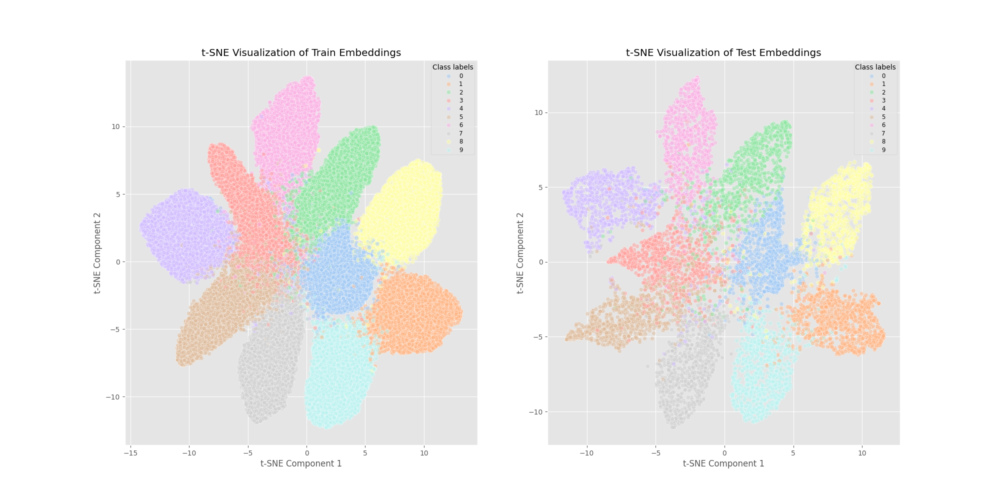
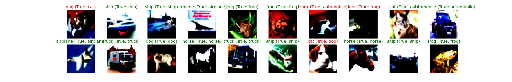

# Explainable AI Project: Anonymization and Online Learning Of Image Embeddings

This project aims to evaluate different anonymization and online continual learning techniques on CIFAR10/CIFAR100 image embeddings. Through the experiments, we also aim to explore benefits of working with feature embeddings (instead of raw data), especially towards better explainability of the models and techniques employed.

## Table of contents

* [Introduction](#introduction)
* [Installation](#installation)
* [Getting started](#getting-started)
* [Usage](#usage)
* [Experiment results](#experiment-results)
* [Known issues and limitations](#known-issues-and-limitations)


## Introduction

This project aims to investigate the effectiveness of the k-Nearest Neighbors (kNN) algorithm using features extracted by different Convolutional Neural Network (CNN) architectures as well as foundation models such as DINOv2. In the first stage, our primary objective was to determine how the source of feature extraction influences the accuracy of kNN in classifying images from the CIFAR-10 and CIFAR-100 datasets. In the second stage, we carried out experiments to explore suitable methods to anonymize feature embeddings, which is becoming an important procedure when collaborative machine learning requires privacy preservation of local data. Our research questions focused on how kNN complements deep neural networks in classification tasks, especially in special applications such as anonymized or online continual settings. Through studying the capability of kNN for image classification tasks using deep learning representations, we aim to provide insights into optimization possibilities. These findings can inspire further research on more efficient and robust kNN-based approaches, potentially tackling their intrinsic limitations as well as overcoming drawbacks of deep neural networks in classification scenarios.

## Installation

### Requirements:
- Python 3.10+
- PyTorch 2.1.0+
- CUDA 12.1+
- torchinfo 1.8.0+
- Numpy 1.25.2+
- Scikit-learn 1.2.2+
- Scipy 1.11.4+
- Matplotlib 3.7.1+


## Getting started

Clone this repository:

```sh
git clone https://github.com/myng15/xAI-project-computer-vision.git
```


## Usage
### Project structure

The project is structured into the following main components:
- **datasets.py**: Methods for preprocessing the CIFAR10/CIFAR100 datasets
- **models.py**: Implementation of neural networks needed, primarily of various CNNs to be used as feature extractors
- **train.py**: Functions for training and validating feature extractor models
- **utils.py**: Project-wide utility functions for training and evaluating models
- **test.py**: Script to evaluate feature extractor models on test datasets
- **visualization.py**: Functions for visualizing results of model training and evaluation, anonymization metrics, etc.
- **knn**: Folder containing code implementing classification of embeddings using k-nearest neighbors (kNN)
- **anonymization**: Folder containing code implementing anonymization of embeddings
- **online**: Folder containing code implementing online continual learning of embeddings
- **outputs**: Folder containing model checkpoints, result plots, etc.
- **embeddings**: Folder containing embeddings originally extracted by feature extractor models and after anonymization as well as visualizations of anonymized embeddings 
- **project-[PROJECT_STEP]-[DATASET_USED].ipynb**: Notebooks for running experiments in each project step

### Basic operation

The basic flow for running experiments in this project is as follows:

1. In `project-step-0-train-CNN-[DATASET_USED].ipynb`, train CNN models that are defined in `models.py` on the specified [DATASET_USED] (`cifar10`/`cifar100`) by following these steps:
- Set the hyperparameters and optimizations
- For documentation, set `optim_code` to the code combination of all optimizations used, starting with `_` - List of all optimizations (and their assigned codes) that we have experimented with can be viewed in `project-step-0-train-CNN-[DATASET_USED].ipynb`. Feel free to add your own optimizations.
- Select a CNN model and train it by running a command such as:
```sh
%%time
from train import train

train(num_classes=num_classes, model=model, model_name='resnet18_custom',
      batch_size=batch_size, num_workers=num_workers, epochs=epochs,
      lr_scheduler=lr_scheduler,
      loss_func=loss_func, optimizer=optimizer, grad_clip=grad_clip,
      train_transform=train_transform, test_transform=test_transform,
      optim_code='_13hj') # Set `optim_code` for later reference and documentation
```
- To evaluate the model on the test dataset, run a command such as:
```sh
!python test.py --num_classes 10 --cp_datetime '20240130_143435' --optim_code '_13hj' --model_name 'resnet18_custom' --batch_size 64 --num_workers 2
```

2. In `project-step-1-kNN-classification-[DATASET_USED].ipynb`, run a command such as the following to extract embeddings using a trained CNN model (especially the best performing from the earlier step) and evaluate kNN classification of these embeddings: 
```sh
!python knn/knn_classification.py --num_classes 10 --cp_datetime '20240130_143435' --optim_code '_13hj' --model_name 'resnet18_custom' --batch_size 64 --num_workers 2 --n_neighbors 5 --visualize_embeds --visualize_knn
```
Adjust the arguments as necessary, e.g. use `--num_classes 100` for CIFAR100. Specify the desired CNN checkpoint using `--model_name`, `--cp_datetime` and `--optim_code` as saved from the earlier step.

`--visualize_embeds` (and optionally `--visualization_method`) and `--visualize_knn` are optional arguments: 
- `--visualize_embeds` (and optionally `--visualization_method`): Visualize the extracted embeddings in a t-SNE or PCA plot (default: `--visualization_method` is `t-SNE`)

<p align="center">
<br>
<em>Figure: t-SNE Visualization of Train and Test Embeddings extracted by custom ResNet18 (optim_code: 13hj).</em>
</p>

- `--visualize_knn`: Visualize kNN classification results for a test embeddings sample
<p align="center">
<br>
<em>Figure: Visualization of kNN classification results for a test embeddings sample extracted by a simple custom CNN (optim_code: 1359).</em>
</p>

3. In `project-step-3-experiment-anonymization-[DATASET_USED].ipynb`, run a command such as the following to anonymize embeddings extracted by a specified model using a specified anonymization method:
- Permutation:
```sh
!python knn/knn_classification_anonymized.py --num_classes 10 --cp_datetime '20240130_143435' --optim_code '_13hj' --model_name 'resnet18_custom' --n_neighbors 5 --anonym_method 'permutation'
```

- Random Noise Addition e.g. Uniform noise (`--anonym_method 'random'`), Laplace noise (`--anonym_method 'laplace'`), Gaussian noise (`--anonym_method 'gaussian'`):
```sh
!python knn/knn_classification_anonymized.py --num_classes 10 --cp_datetime '20240130_143435' --optim_code '_13hj' --model_name 'resnet18_custom' --n_neighbors 5 --anonym_method 'laplace' --noise_scale 0.1 
```

- PCA:
```sh
!python knn/knn_classification_anonymized.py --num_classes 10 --cp_datetime '20240130_143435' --optim_code '_13hj' --model_name 'resnet18_custom' --n_neighbors 5 --anonym_method 'pca' --n_components 10
```

- Density-based Clustering + Random Noise Addition:
```sh
!python knn/knn_classification_anonymized.py --num_classes 10 --cp_datetime '20240130_143435' --optim_code '_13hj' --model_name 'resnet18_custom' --n_neighbors 5 --anonym_method 'density_based' --max_dist 5 --min_samples 3 --noise_scale 0.1
```

- K-Means Clustering + Aggregation (`--assign_labels 'majority'` or `--assign_labels 'centroid'`) + Optional Random Noise Addition:
```sh
!python knn/knn_classification_anonymized.py --num_classes 10 --cp_datetime '20240130_143435' --optim_code '_13hj' --model_name 'resnet18_custom' --n_neighbors 5 --anonym_method 'kmeans' --n_clusters 1000 --assign_labels 'majority' --noise_scale 0.25
```

- Synthetic embeddings (created by Generative Adversarial Networks):
After training and saving your GAN model, run the following to create synthetic (and thus anonymized) embeddings using the GAN: 
```sh
!python knn/knn_classification_anonymized.py --num_classes 10 --cp_datetime '20240130_143435' --optim_code '_13hj' --model_name 'resnet18_custom' --n_neighbors 5 --anonym_method 'gan'
```

You can also add to these commands the argument `--visualize_embeds` (and optionally `--visualization_method`) to visualize the anonymized embeddings. `--visualize_knn`, however, is not available here.

**Tuning mode**: You can run experiments with multiple sets of parameters for a specific anonymization method using just one command such as:
```sh
!python knn/knn_classification_anonymized.py --num_classes 10 --cp_datetime '20240130_143435' --optim_code '_13hj' --model_name 'resnet18_custom' --n_neighbors 5 --anonym_method 'kmeans' --tuning --n_clusters_tuning 1000 2500 5000 --assign_labels_tuning 'centroid' 'majority' --noise_scale_tuning 0.25 0.5 0.75
```

4. In `project-step-3-experiment-online-learning-[DATASET_USED].ipynb`, use a command such as the following to run a specified online domain incremental learning method on embeddings extracted by a specified model:
- Using kNN classifier (without generative replay):
```sh
!python online/online_learning.py --num_classes 10 --cp_datetime '20240130_143435' --optim_code '_13hj' --model_name 'resnet18_custom' --n_rounds 10 --batch_size 1000 --n_neighbors 5
```

- Using Nearest Class Mean (`--classifier 'NCM'`) or Fully Connected (`--classifier 'FC'`) classifier (without generative replay):
```sh
!python online/online_learning.py --num_classes 10 --cp_datetime '20240130_143435' --optim_code '_13hj' --model_name 'resnet18_custom' --n_rounds 10 --batch_size 1000 --classifier 'NCM' --n_neighbors 5
```

- Using kNN classifier (with generative replay):
```sh
!python online/online_learning.py --num_classes 10 --cp_datetime '20240130_143435' --optim_code '_13hj' --model_name 'resnet18_custom' --n_rounds 10 --batch_size 1000 --n_neighbors 5 --generative_replay --n_epochs_gan 10 --batch_size_gan 32
```

- Using NCM classifier (with generative replay):
```sh
!python online/online_learning.py --num_classes 10 --cp_datetime '20240130_143435' --optim_code '_13hj' --model_name 'resnet18_custom' --n_rounds 10 --batch_size 1000 --classifier 'NCM' --n_neighbors 5 --generative_replay --n_epochs_gan 10 --batch_size_gan 32
```

Adding the argument `--memory_sample_percentage`, you can specify the percentage of generative replay memory you want to augment your classification data with (default: `1.0` for 100% memory), e.g.
```sh
!python online/online_learning.py --num_classes 10 --cp_datetime '20240130_143435' --optim_code '_13hj' --model_name 'resnet18_custom' --n_rounds 10 --batch_size 1000 --n_neighbors 5 --generative_replay --n_epochs_gan 10 --batch_size_gan 32 --memory_sample_percentage 0.75
```

## Experiment results
### Train CNNs and evaluate kNN classification performance
Our best performing own feature extractor model is the custom ResNet18 (11.5M parameters) trained with the following optimizations: 
- data augmentation with random cropping and horizontal flipping, 
- Adam optimizer (lr=0.001, weight_decay=0.0001), 
- gradient clipping value of 0.5

|          | Train Acc.         | Validation Acc. | Test Acc. | KNN Acc.            |
|:---------|:-------------------|:----------------|:----------|:--------------------|
| CIFAR10  | 93.96%             | 89.12%          | 90.03%    | 89.91%              |
| CIFAR100 | 82.87%             | 64.31%          | 63.63%    | 63.28%              |

### Anonymization of Embeddings
Metrics to evaluate anonymization methods:

1. **Privacy:**

- **Overlap** between original and anonymized embeddings (whether there is an embedding in the anonymized set that remains unchanged from the original): No overlaps is the minimum requirement to guarantee anonymization.

- **Reconstruction Error** (mean squared difference between the original and anonymized set): Indicates how much altered the anonymized embeddings manages to get compared to the original. Higher reconstruction error values are desirable for better anonymization, but can decrease the utility of the embeddings.

<p align="center">
<br>
<em>Figure: Example plot of KNN Classifier (trained on Anonymized Train Embeddings) Accuracy on Anonymized Test Embeddings (extracted by custom ResNet18 (optim_code: 13hj)) vs. their Reconstruction Error.</em>
</p>

2. **Utility:**

- **KNN Classifier Accuracy on Anonymized Test Embeddings**

**Note:** Actually visualized in result plots is the Accuracy Loss between the KNN Classifier (trained on Original Train Embeddings) Accuracy on Original Test Embeddings and the KNN Classifier (trained on Anonymized Train Embeddings) Accuracy on Anonymized Test Embeddings. Negative accuracy loss values mean that the KNN Classifier (trained on Anonymized Train Embeddings) Accuracy on Anonymized Test Embeddings is higher than the KNN Classifier (trained on Original Train Embeddings) Accuracy on Original Test Embeddings.

Higher accuracy values or lower accuracy loss values are an indicator of better utility of the embeddings, but possibly also of less privacy.

- **Projection Robustness** (absolute difference between the mean pairwise distance between the embeddings before and after anonymization): Indicates how well the anonymized embeddings maintain their relative distances or relationships in the projected space. **Lower** values of this metric means **more** projection robustness, which is desirable for better utility, but possibly not for more privacy. 

<p align="center">
<br>
<em>Figure: Example plot of KNN Classifier (trained on Anonymized Train Embeddings) Accuracy on Anonymized Test Embeddings (extracted by custom ResNet18 (optim_code: 13hj)) vs. their Projection Robustness.</em>
</p>

#### Suggested Evaluation Framework

- Minimum requirement: No overlaps between original and anonymized embeddings

- Trade-off between Classification Accuracy (Utility) and Anonymization (Privacy)

> Hypothesis: Accuracy loss correlates… 
> 
> positively with Privacy e.g. Reconstruction Error
> 
> negatively with Utility e.g. Projection Robustness

- Empirical risk of re-identification under (emulated) efforts to reconstruct/hack the anonymized embeddings

### Online Domain Incremental Learning of Embeddings
#### Experimental setup: 
- **Input data/class distributions:** Each incoming batch is drawn from the database of CIFAR10/CIFAR100 embeddings (only samples that are unseen, i.e. not used in previous batches) and contains the same number of samples from each class. All classes of CIFAR10/CIFAR100 are present in each incoming batch.
- **Classifiers:** KNN, NCM, KNN combined with NCM, Fully Connected
- **Data augmentation:** without vs. with generative replay (with different sizes of replay memory)
- **Metrics:**
  - Average Accuracy
  - Average Forgetting
  - Average Positive Backward Transfer
  - Average Forward Transfer
  - Average Training Time
  - Average Inference Time

<p align="center">
<br>
<em>Figure: Example plot of Average Accuracy vs. Incoming Batch Size in Online Domain Incremental Learning of Embeddings (extracted by custom ResNet18 (optim_code: 13hj)).</em>
</p>

## Known issues and limitations

- Metrics for evaluating anonymization methods are still limited due to difficulty in comparing anonymized embeddings against original embeddings (at least using simple calculations) and across different anonymization methods
- Further consideration is to be given to the effectiveness of online learning using feature embeddings and non-parametric classifiers such as kNN, e.g. the need to develop a more effective GAN model for synthesizing embeddings (not raw image data as usually is the norm), as the experiments show empirically that the quality of synthetic embeddings decides how much generative replay improves or impairs online incremental learning of embeddings.


